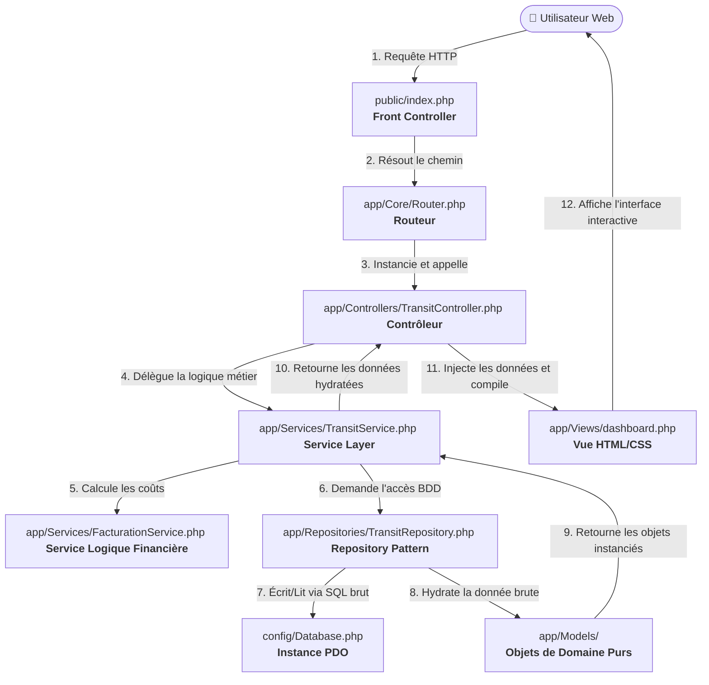

# 🎓 TransitPro — Guide Complet de l'Architecture & Présentation (Exposé)

Ce document constitue le **support de documentation ultime et complet** du projet **TransitPro**, conçu spécifiquement pour servir de guide lors de votre présentation orale (exposé). Il décrit l'architecture logicielle, détaille chaque dossier et fichier, explique les règles métiers logistiques et financières, et détaille les mécanismes de sécurité implémentés.

---

## 🗺️ Table des Matières
1. [🏗️ Fiche d'Identité & Objectifs du Projet](#-fiche-didentité--objectifs-du-projet)
2. [⚙️ Architecture Globale & Choix Techniques](#%EF%B8%8F-architecture-globale--choix-techniques)
3. [📂 Arborescence Détaillée du Projet](#-arborescence-détaillée-du-projet)
4. [🧠 Analyse Dossier par Dossier & Fichier par Fichier](#-analyse-dossier-par-dossier--fichier-par-fichier)
5. [💰 Règles de Calcul & Tarification (GNF)](#-règles-de-calcul--tarification-gnf)
6. [🔒 Sécurité & Bonnes Pratiques de Codage](#-sécurité--bonnes-pratiques-de-codage)
7. [🎤 Guide de Présentation pour l'Oral (Scénario de Démo)](#-guide-de-présentation-pour-loral-scénario-de-démo)

---

## 🏗️ Fiche d'Identité & Objectifs du Projet

### Fiche d'Identité
* **Nom du Projet :** TransitPro
* **Nature de l'Application :** Logiciel ERP Web de gestion des flux logistiques et de facturation automatique.
* **Langages & Technologies :** PHP 8.2+ (POO stricte, PDO), HTML5, CSS3 (Vanilla Premium), Vanilla JavaScript, MySQL (WampServer/XAMPP).
* **Autochargement (Autoloading) :** Autoloader fait maison 100% Vanilla PHP (conforme à la norme PSR-4).
* **Devise Comptable :** GNF (Franc Guinéen) — Adapté au secteur minier et logistique de la République de Guinée.

### Objectifs Majeurs
1. **Suivi en temps réel** des marchandises transitant entre les principales villes de Guinée (Conakry, Kamsar, Boké, Kankan) et de la sous-région (Dakar, Bamako, Abidjan).
2. **Automatisation de la Facturation** dès la saisie d'un transit, selon des règles de calcul strictes dépendantes du mode de transport.
3. **Sécurité Absolue** des accès et des transactions financières (protection contre les injections SQL, hachage Bcrypt des mots de passe, protection contre les failles XSS).
4. **Maintenabilité et Scalabilité** grâce à un découplage total des responsabilités (MVC + Service Layer + Repository Pattern).

---

## ⚙️ Architecture Globale & Choix Techniques

TransitPro ne se contente pas du pattern **MVC (Modèle-Vue-Contrôleur)** classique. Pour éviter le phénomène du *"gros contrôleur"* (Bloated Controller) ou du *"gros modèle"* (Active Record mélangé au SQL), l'application implémente des patrons de conception d'entreprise (Enterprise Design Patterns) :



### Explication des Patrons de Conception Utilisés

1. **Front Controller (Contrôleur Frontal) :** `public/index.php` est le point d'entrée unique. Aucun autre fichier PHP n'est directement accessible depuis le navigateur, ce qui sécurise l'application et centralise l'autoloader, l'initialisation et la gestion des sessions.
2. **Router (Routeur Customisé) :** Résout dynamiquement les URLs propres sans exposer l'extension `.php` au client (ex: `/expeditions` au lieu de `expeditions.php`).
3. **Service Layer (Couche de Services Métier) :** Les fichiers sous `app/Services/` concentrent l'intelligence d'affaires (business logic) : validations, orchestration des créations d'entités complexes, génération de numéros de facture.
4. **Repository Pattern (Dépôt d'Accès aux Données) :** La classe `TransitRepository` isole le SQL du reste de l'application. Elle est la seule autorisée à exécuter des requêtes brutes sur PDO MySQL, puis à reconstruire des objets métiers.
5. **Dependency Inversion Principle (DIP - Inversion des Dépendances) :** L'utilisation de l'interface `App\Interfaces\Facturable` permet au `FacturationService` de calculer des factures sur n'importe quel objet futur (ex: douane, stockage) sans être couplé rigidement à la classe `Transit`.

---

## 📂 Arborescence Détaillée du Projet

Voici la structure exacte des répertoires de **TransitPro** :

```text
transit/
├── app/                              # 🧠 LE CŒUR DE L'APPLICATION (Code source)
│   ├── Abstracts/                    # Classes abstraites partagées
│   │   └── Entity.php                # Modèle parent imposant l'ID et toArray()
│   ├── Controllers/                  # 🎛️ CONTROLEURS (Aiguillage HTTP)
│   │   ├── AuthController.php        # Gère la connexion, déconnexion et sessions
│   │   └── TransitController.php     # Gère le tableau de bord, les expéditions, factures et settings
│   ├── Core/                         # ⚙️ MOTEUR DU FRAMEWORK CUSTOM
│   │   ├── Controller.php            # Classe mère fournissant la méthode view() et redirect()
│   │   ├── Model.php                 # Classe pédagogique d'accès direct PDO (non utilisée)
│   │   └── Router.php                # Analyse l'URL et résout le callback (GET/POST)
│   ├── Interfaces/                   # Contrats d'interfaces
│   │   └── Facturable.php            # Impose getBaseCalcul() et getTarifUnitaire()
│   ├── Models/                       # 📦 MODÈLES DE DOMAINE (Objets PHP purs sans SQL)
│   │   ├── Client.php                # Entité Client (Nom, Email)
│   │   ├── Facture.php               # Entité Facture immuable (Numéro, Brut, TTC, Date)
│   │   ├── Marchandise.php           # Entité Marchandise (Désignation, Poids, Surface, État)
│   │   ├── ModeTransport.php         # Entité ModeTransport (Maritime, Aérien, Terrestre, Ferroviaire)
│   │   ├── Pays.php                  # Entité Pays
│   │   ├── Transit.php               # Entité Transit (Départ, Arrivée, Dates, Marchandise, Mode, Distance)
│   │   └── Ville.php                 # Entité Ville avec coordonnées géographiques (Lat, Lng)
│   ├── Repositories/                 # 🗄️ PERSISTANCE (Écriture SQL et Hydratation d'objets)
│   │   └── TransitRepository.php     # Requetes SQL préparées et hydratation d'objets de domaine
│   ├── Services/                     # 🚀 LOGIQUE METIER & ORCHESTRATION
│   │   ├── AuthService.php           # Logique d'authentification utilisateur
│   │   ├── DatabaseInitializer.php   # Création automatisée des tables et seeding initial (admin/tarifs)
│   │   ├── FacturationService.php    # Calculs mathématiques des montants HT et TTC
│   │   └── TransitService.php        # Orchestrateur (valide les formulaires, lie les modèles, émet les factures)
│   └── Views/                        # 🎨 VUES TEMPLATES (Rendu visuel HTML/CSS/JS injecté de PHP)
│       ├── dashboard.php             # Tableau de bord principal, cartes interactives et graphiques
│       ├── expeditions.php           # Registre complet et interactif des transits
│       ├── factures.php              # Registre légal des factures et bilans de trésorerie
│       ├── login.php                 # Interface d'accès sécurisée (Dark Mode Premium)
│       └── settings.php              # Interface de réglage de la TVA et des tarifs unitaires
├── config/                           # ⚙️ CONFIGURATIONS DE L'APPLICATION
│   └── Database.php                  # Gestionnaire de connexion sécurisée PDO
├── docs/                             # 📚 DOCUMENTATION TECHNIQUE ET LOGIQUE
│   ├── ARCHITECTURE.md               # Explication de la sécurité par masquage de dossier
│   ├── Analyse_cahier_de_charge.md   # Critique constructive et points d'amélioration
│   ├── Cahier_de_charge.md           # Spécifications d'origine du projet
│   └── DOCUMENTATION_EXPOSE.md       # Ce guide de présentation pour l'exposé
├── public/                           # 🛡️ LA VITRINE PUBLIQUE (Seul dossier accessible à l'URL externe)
│   ├── css/                          # Styles CSS (Design premium avec variables globales, transitions)
│   ├── images/                       # Logotypes et ressources illustratives
│   ├── js/                           # Scripts dynamiques pour la carte interactive et les formulaires
│   ├── .htaccess                     # Fichier de réécriture d'URL Apache (masque index.php)
│   └── index.php                     # Le Front Controller d'accueil
├── app/
│   └── autoload.php                  # 📚 AUTO-CHARGEMENT NATIF (spl_autoload_register)
├── .htaccess                         # Redirige les requêtes de la racine du projet vers le dossier public/
└── README.md                         # Guide de mise en route rapide en local
```

---

## 🧠 Analyse Dossier par Dossier & Fichier par Fichier

### 1. Le Dossier Racine (`/`)
* **`app/autoload.php`** :
  Notre autoloader natif fait maison compatible avec la norme professionnelle **PSR-4**. Il s'enregistre via la fonction native PHP `spl_autoload_register` et associe dynamiquement l'espace de noms `App\` au dossier `app/` et `App\Config\` au dossier `config/`. Cela élimine définitivement les écritures fastidieuses de `require_once` manuels qui alourdissent le code et provoquent des erreurs d'inclusions cycliques.
* **`.htaccess` (Racine)** :
  Redirige de manière totalement transparente les utilisateurs qui se rendent sur `http://localhost/transit` directement vers `http://localhost/transit/public/`. Ainsi, le visiteur ne voit jamais la structure des dossiers internes.

---

### 2. Le Dossier de Configuration (`config/`)
* **`Database.php`** :
  Cette classe gère la connexion **PDO (PHP Data Objects)**.
  * **Sécurité PDO :** Elle désactive l'émulation des requêtes préparées (`PDO::ATTR_EMULATE_PREPARES => false`) pour forcer l'utilisation du moteur natif de MySQL. Cela garantit une barrière infranchissable contre les injections SQL.
  * **Création dynamique :** Lors de la première connexion, elle se connecte d'abord à MySQL sans spécifier de base de données, puis exécute un `CREATE DATABASE IF NOT EXISTS transit CHARACTER SET utf8mb4` pour éviter au développeur ou à l'administrateur d'avoir à créer manuellement la base de données.

---

### 3. Le Dossier Public (`public/`)
C'est le **seul et unique** répertoire exposé au Web.
* **`index.php` (Front Controller)** :
  C'est le guichetier de l'application. Son cycle d'exécution est minutieusement ordonné :
  1. Active l'affichage complet des erreurs PHP pour le développement.
  2. Charge l'autoloader fait maison (100% Vanilla PHP).
  3. Instancie `DatabaseInitializer` pour s'assurer que la base de données est structurée et alimentée (seeding).
  4. Instancie le `Router`.
  5. Inclut le fichier de routage `routes/web.php`.
  6. Appelle `$router->resolve()` pour exécuter le contrôleur adéquat.
* **`.htaccess` (public)** :
  Assure la réécriture d'URL. Si l'utilisateur tape `/expeditions`, Apache réécrit l'URL en arrière-plan en `index.php?url=/expeditions` sans que l'utilisateur ne le voie dans sa barre d'adresse.

---

### 4. Le Noyau de l'Application (`app/Core/`)
Ce dossier contient le moteur interne, codé de manière pure pour comprendre comment fonctionnent les grands frameworks industriels (Laravel, Symfony).
* **`Router.php`** :
  Contient un tableau multidimensionnel `$routes` enregistrant les chemins associés aux méthodes HTTP (`GET` et `POST`). La méthode `resolve()` analyse l'URL demandée (en nettoyant les dossiers d'installation sous WAMP), extrait le chemin pur, instancie dynamiquement la classe du contrôleur configuré et appelle la méthode correspondante via la syntaxe dynamique PHP : `$controller->$method()`.
* **`Controller.php`** :
  Classe abstraite mère. Fournit la fonction protégée `view(string $view, array $data)` qui utilise `extract($data)` pour transformer les clés de tableaux associatifs en véritables variables locales PHP utilisables directement dans les fichiers de vue HTML. Elle contient également `redirect(string $url)` pour envoyer des en-têtes HTTP 302 propres.
* **`Model.php`** :
  Classe d'accès direct PDO. Elle n'est pas exploitée dans TransitPro car nous avons fait le choix de découpler totalement la base de données de nos modèles en insérant la couche Repository. Elle est conservée à but purement pédagogique pour montrer l'architecture classique standard.

---

### 5. Les Contrats & Abstractions (`app/Interfaces/` & `app/Abstracts/`)
* **`Entity.php` (Classe Abstraite)** :
  Modèle parent dont héritent tous les modèles métiers (`Client`, `Marchandise`, `Transit`, etc.). Centralise la propriété `$id` commune ainsi que ses accesseurs. Elle impose également à chaque classe enfant d'implémenter la méthode `toArray()`, cruciale pour sérialiser les données ou les envoyer en JSON.
* **`Facturable.php` (Interface)** :
  Exprime un contrat financier de haut niveau. Tout objet implémentant ce contrat doit fournir sa base de calcul (poids ou surface) et son tarif unitaire applicable. C'est l'illustration parfaite du principe **SOLID ISP (Interface Segregation Principle)**.

---

### 6. Les Modèles Métiers (`app/Models/`)
Ce sont des classes PHP pures (**POO Stricte**), ne contenant aucun code SQL. Elles sont très légères et ne gèrent que la cohérence des données :
* **`Transit.php`** :
  Modèle central. Il intègre de fortes contraintes métier :
  * Une composition stricte avec les classes `Ville`, `Marchandise` et `ModeTransport`.
  * L'implémentation formelle de l'interface `Facturable`.
  * La résolution automatique de sa base de calcul : retourne la surface (`$marchandise->getSurface()`) si le transport est de type Maritime, sinon retourne son poids (`$marchandise->getPoids()`).
* **`Facture.php`** :
  Conçue de manière **rigoureusement immuable** pour respecter la législation comptable. Contrairement à une conception naïve qui recalculerait le montant à chaque affichage (ce qui modifierait les anciennes factures si les tarifs unitaires changeaient dans le futur), la facture enregistre définitivement son montant HT (`montant_brut`), son montant TTC (`montant_ttc`) et sa `base_calcul` calculés à l'instant précis de son émission.

---

### 7. La Persistance (`app/Repositories/`)
* **`TransitRepository.php`** :
  C'est l'unique gardien de l'accès à la base de données.
  * **Hydratation avancée :** La méthode `findAllTransits()` exécute une requête SQL contenant de multiples jointures complexes (`JOIN` et `LEFT JOIN`) pour assembler en une seule passe le Transit, sa Ville de départ, sa Ville d'arrivée, son Pays, sa Marchandise, son Client, son Mode de Transport et sa Facture liée. Elle effectue ensuite l'**hydratation manuelle**, c'est-à-dire qu'elle instancie un à un les objets PHP et les injecte les uns dans les autres pour retourner un tableau d'objets `Transit` parfaitement structurés.
  * **Création dynamique de Ville/Pays :** Intègre une logique intelligente (`resolveDynamicCity`) : si l'utilisateur saisit une nouvelle ville de transit non présente dans la base, le Repository crée à la volée le nouveau pays (si absent) puis la ville associée avec ses coordonnées géographiques facultatives, et renvoie son ID pour l'associer au transit.

---

### 8. Les Services Applicatifs (`app/Services/`)
* **`TransitService.php`** :
  C'est l'orchestrateur général de l'application. Il :
  1. Intercepte les soumissions de formulaires.
  2. Effectue les **validations de cohérence strictes** : vérifie que la ville de départ est différente de la ville d'arrivée, que le poids et la surface sont strictement positifs, et que la date de départ est chronologiquement antérieure à la date d'arrivée.
  3. Utilise le Repository pour enregistrer les clients, marchandises et transits.
  4. Appelle le `FacturationService` pour générer et enregistrer immédiatement la facture historique et immuable associée à la transaction logistique.
* **`FacturationService.php`** :
  Encapsule la logique mathématique financière pure. Il applique les formules réglementaires :
  $$\text{Montant Brut (HT)} = \text{Base de Calcul (Poids ou Surface)} \times \text{Tarif Unitaire}$$
  $$\text{Montant TTC} = \text{Montant Brut (HT)} \times (1 + \text{TVA})$$
* **`AuthService.php`** :
  Gère l'authentification sécurisée des utilisateurs :
  * Recherche l'administrateur par son nom d'utilisateur dans la table `utilisateurs`.
  * Utilise la fonction native sécurisée PHP `password_verify` pour valider que le mot de passe en clair envoyé correspond au hash chiffré stocké en base de données.
* **`DatabaseInitializer.php`** :
  Le créateur de l'univers de l'application. Si la base de données MySQL est vide (détection de l'absence de la table `villes`), il :
  * Crée toutes les tables avec les contraintes d'intégrité référentielles (clés étrangères `FOREIGN KEY` pour éviter les orphelins).
  * Effectue le **seed structurel** : insère la Guinée, le Sénégal, la Côte d'Ivoire, le Mali, leurs villes majeures (Conakry, Boké, Dakar, Abidjan, etc.) avec leurs latitudes/longitudes géographiques exactes, configure les tarifs des modes de transport initiaux et le taux de TVA à 20%.
  * **Sécurisation Admin :** Si aucun administrateur n'existe, il génère le compte par défaut `admin` avec le mot de passe sécurisé et haché `admin123`.

---

### 9. L'Interface Utilisateur (les Vues dans `app/Views/`)
L'application propose un design haut de gamme et responsive développé en **CSS Vanilla Premium** :
* **`login.php`** : Interface de connexion avec un style sombre, une boîte d'authentification en verre dépoli (Glassmorphism), et des micro-animations fluides.
* **`dashboard.php`** : Tableau de bord qui affiche des indicateurs financiers (Trésorerie TTC globale, Poids et Surface cumulés) sous forme de cartes d'analyse modernes, une liste récapitulative des transits récents, et intègre un formulaire de création dynamique de transit avec option d'ajout de villes personnalisées.
* **`expeditions.php`** : Registre tabulaire des transits permettant de filtrer les informations et d'afficher le détail des marchandises, les pays impliqués, et d'effectuer des suppressions.
* **`factures.php`** : Grand livre comptable affichant chaque facture émise avec son numéro officiel unique, le nom du client et les montants financiers HT/TTC précis.
* **`settings.php`** : Tableau d'administration des prix logistiques unitaires et de la taxe sur la valeur ajoutée (TVA).

---

## 💰 Règles de Calcul & Tarification (GNF)

La tarification logistique de **TransitPro** est modifiable en temps réel par l'administrateur mais repose sur des formules comptables internes rigoureuses :

| Mode de transport | Base de calcul | Tarif unitaire d'origine | Formule Brut HT |
| :--- | :--- | :--- | :--- |
| 🚢 **Maritime** | Surface ($m^2$) | **125 000 GNF** / $m^2$ | $\text{Surface} \times \text{Tarif Unitaire}$ |
| ✈️ **Aérien** | Poids ($kg$) | **450 000 GNF** / $kg$ | $\text{Poids} \times \text{Tarif Unitaire}$ |
| 🚛 **Terrestre** | Poids ($kg$) | **35 000 GNF** / $kg$ | $\text{Poids} \times \text{Tarif Unitaire}$ |
| 🚊 **Ferroviaire** | Poids ($kg$) | **18 000 GNF** / $kg$ | $\text{Poids} \times \text{Tarif Unitaire}$ |

### Exemple Précis de Facturation (Simulation) :
Prenons l'expédition d'un conteneur de matériel informatique de **Conakry** à **Dakar** par voie **Aérienne** :
* **Poids de la marchandise :** $1\ 500\ kg$
* **Surface :** $12\ m^2$
* **Mode :** Aérien (Tarif unitaire : $450\ 000\ GNF$ / $kg$)
* **TVA configurée :** $20\%$ ($0.20$)

**Calculs opérés par `FacturationService` :**
1. **Détermination de la base :** Le mode étant Aérien, la base de calcul retenue est le Poids ($1\ 500$).
2. **Calcul du Montant Brut HT :**
   $$1\ 500 \times 450\ 000 = 675\ 000\ 000\ GNF$$
3. **Calcul du Montant de la TVA :**
   $$675\ 000\ 000 \times 0.20 = 135\ 000\ 000\ GNF$$
4. **Calcul du Montant Final TTC :**
   $$675\ 000\ 000 \times (1 + 0.20) = 810\ 000\ 000\ GNF$$

---

## 🔒 Sécurité & Bonnes Pratiques de Codage

Lors de votre exposé oral, **insister lourdement sur la sécurité** valorisera grandement votre travail devant le jury :

1. **Injections SQL Bloquées à 100% :**
   Toutes les requêtes d'insertion ou de sélection du `TransitRepository` utilisent des requêtes préparées avec des jetons nommés (ex: `:email`, `:username`). Les valeurs saisies par l'utilisateur ne sont jamais concaténées directement dans la requête SQL brute, rendant toute tentative d'injection SQL inoffensive.
2. **Failles XSS Neutralisées :**
   Toutes les saisies de formulaires sont nettoyées à la source dans le `TransitService` grâce à `htmlspecialchars(trim($donnee))`. De plus, les affichages dynamiques dans les fichiers de vue utilisent l'échappement système pour bloquer l'exécution de balises `<script>` malveillantes injectées dans la base de données.
3. **Mots de Passe Ultra-Sécurisés :**
   Aucun mot de passe n'est stocké en clair. L'initialiseur de base de données utilise la fonction `password_hash('password', PASSWORD_DEFAULT)` qui applique l'algorithme standard **Bcrypt**, générant une clé cryptographique unique et salée pour chaque utilisateur.
4. **Filtre de Session Centralisé (Contrôle d'accès) :**
   Au lieu de copier-coller un script de vérification de session sur chaque page (source d'oubli et de faille de sécurité), le contrôle d'accès est centralisé dans le constructeur de `TransitController`. Puisque toutes les pages (Dashboard, Expéditions, Factures, Settings) passent par ce contrôleur, le système vérifie systématiquement la présence de la session active de l'utilisateur. Si elle est absente, l'utilisateur est redirigé vers `/login` et le script est stoppé immédiatement par `exit;`.

---

## 🎤 Guide de Présentation pour l'Oral (Scénario de Démo)

Pour réussir votre exposé, suivez ce scénario de démonstration fluide d'environ 10 à 15 minutes devant votre jury :

### Étape 1 : Présentation Théorique (3-5 minutes)
* **Accroche :** *"Nous vous présentons TransitPro, une solution ERP de gestion logistique et financière adaptée aux flux transitaires de la République de Guinée en Francs Guinéens (GNF)."*
* **Architecture :** Expliquez la fierté technique du projet : *"Nous avons évité les architectures de débutants. Notre code repose sur une séparation totale : MVC renforcé par une couche de Services pour la logique métier pure, et le pattern Repository pour la persistance SQL."*

### Étape 2 : Démonstration Pratique en Direct (5-7 minutes)
1. **La Sécurité au Premier Plan (Connexion) :**
   * Présentez l'écran de login en Dark Mode.
   * Entrez de faux identifiants pour montrer la gestion robuste des erreurs par `AuthService`.
   * Connectez-vous avec `admin` / `admin123`.
2. **Le Tableau de Bord Logistique :**
   * Montrez le Dashboard avec ses cartes d'indicateurs (Chiffre d'Affaires global, Tonnage expédié, Surface cumulée).
   * Expliquez que ces indicateurs sont calculés de façon dynamique à l'aide de jointures SQL performantes.
3. **Le Cycle de Vie d'un Transit (Scénario Clé) :**
   * Remplissez le formulaire de création de transit.
   * **Démonstration de l'intelligence artificielle du système (Ajout de Ville) :** Montrez que l'on peut sélectionner une ville existante ou en ajouter une nouvelle à la volée (ex: taper `NEW|Labe|Guinee|11.31| -12.28`). Expliquez que le système va résoudre et créer dynamiquement cette nouvelle ville géolocalisée en arrière-plan.
   * Choisissez le transport **Maritime**. Indiquez une surface de conteneur.
   * Soumettez le formulaire.
4. **Visualisation de la Facture Générée :**
   * Rendez-vous sur l'onglet **Factures**.
   * Montrez la facture qui vient d'être émise automatiquement avec son numéro officiel unique (`FAC-2026-XXXX`). Expliquez au jury le principe d'**immuabilité** de cette facture (sécurité comptable essentielle).
5. **Gestion & Configuration (Settings) :**
   * Allez sur la page **Paramètres**.
   * Modifiez le tarif de l'Aérien ou modifiez le taux de TVA.
   * Expliquez que cela s'enregistre dans la table `settings` et s'appliquera immédiatement aux futures factures sans jamais déformer les montants historiques des factures existantes.

### Étape 3 : Conclusion & Questions (2 minutes)
* **Résumé :** *"TransitPro démontre qu'avec une structure logicielle propre en PHP natif orienté objet, on obtient une application web à la fois extrêmement sécurisée, hautement performante et prête pour la production dans des contextes réels d'affaires."*
* **Ouverture aux Questions :** *"Nous vous remercions pour votre attention et sommes prêts à répondre à vos questions sur notre code source ou nos choix d'architecture."*
